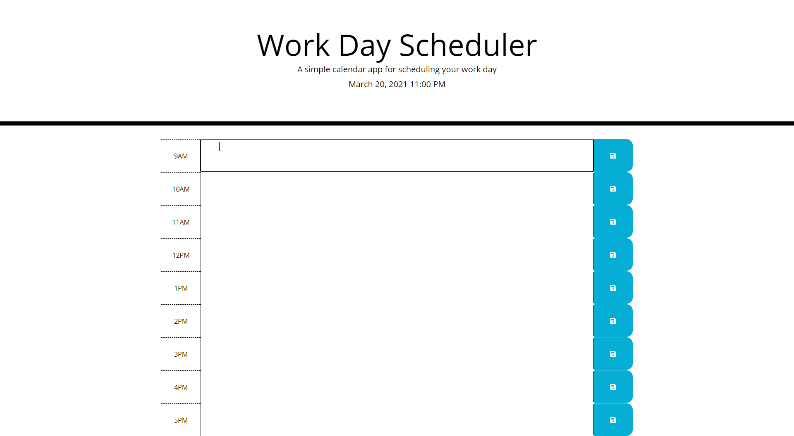

# Work Day Scheduler

This is a simple calendar application that allows a user to save events for each hour of the day by entering text into the boxes and pressing the save button. This app will run in the browser and will show correct date and time on the top. The sections will display a different color depending on what time of day it is.

# How it works

Simply click on the day that you wish to schedule and write your comment. Then, click save to store the information. Past times will be in gray, present time will be in red, and future times will be in green. When the save button is clicked, a swirl icon will show that the entry has been recorded.

# Screenshot

# Deployed Application

[work-day-scheduler](https://ericaroq.github.io/work-day-scheduler/)

# Resources

* https://www.w3schools.com
* https://stackoverflow.com
* https://udemy.com
* https://developer.mozilla.org

